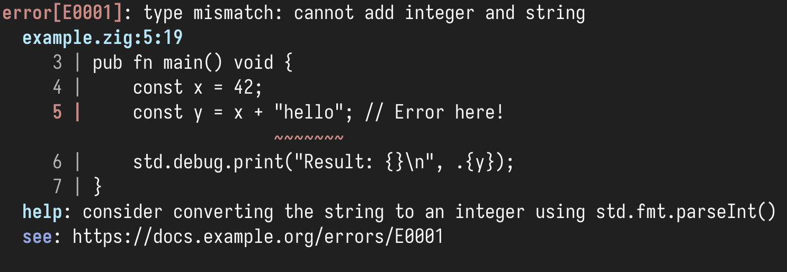
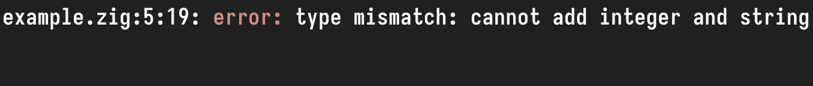
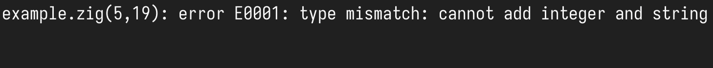

# fehler

A comprehensive error reporting system for Zig that provides rich, colorful diagnostic output similar to modern compilers like Rust's `rustc` and Zig's own compiler.


## Features

- 🎨 **Colorful Output**: ANSI color-coded diagnostics with severity-based coloring
- 📍 **Range-Based Highlighting**: Precise source range highlighting with start and end positions
- 📝 **Source Context**: Displays source code snippets with error highlighting
- 🎯 **Smart Underlining**: Uses carets (`^`) for single characters and tildes (`~`) for ranges
- 🔧 **Help Messages**: Optional help text for guiding users to solutions
- 🏗️ **Fluent Interface**: Builder pattern for easy diagnostic construction
- 🧠 **Memory Safe**: Proper memory management with allocator-based design
- 🎨 **Multiple Output Formats**: Supports `Fehler` (default), `GCC`, and `MSVC` styles

## Install

### Latest Release (recommended)

```shell
zig fetch --save "git+https://github.com/ciathefed/fehler#v0.5.1"
````

### Latest on `main` (bleeding edge)

```shell
zig fetch --save "git+https://github.com/ciathefed/fehler#main"
```

Add this snippet to your `build.zig`:

```zig
const fehler = b.dependency("fehler", .{
    .target = target,
    .optimize = optimize,
});
exe_mod.addImport("fehler", fehler.module("fehler"));
```

## Quick Start

```zig
const std = @import("std");
const ErrorReporter = @import("fehler").ErrorReporter;
const Diagnostic = @import("fehler").Diagnostic;
const Severity = @import("fehler").Severity;
const SourceRange = @import("fehler").SourceRange;

pub fn main() !void {
    var gpa = std.heap.GeneralPurposeAllocator(.{}){};
    defer _ = gpa.deinit();
    const allocator = gpa.allocator();

    // Initialize reporter with default Fehler format
    var reporter = ErrorReporter.init(allocator);

    // Or specify a different format with withFormat()
    // var reporter = ErrorReporter.init(allocator).withFormat(.gcc);

    defer reporter.deinit();

    const source =
        \\const std = @import("std");
        \\
        \\pub fn main() void {
        \\    const x = 42;
        \\    const y = x + "hello"; // Error here!
        \\    std.debug.print("Result: {}\n", .{y});
        \\}
    ;

    try reporter.addSource("example.zig", source);

    const diagnostic = Diagnostic.init(.err, "type mismatch: cannot add integer and string")
        .withRange(SourceRange.span("example.zig", 5, 19, 5, 25))
        .withHelp("consider converting the string to an integer using std.fmt.parseInt()")
        .withCode("E0001")
        .withUrl("https://docs.example.org/errors/E0001");

    reporter.report(diagnostic);
}
```

## Output Examples

### Fehler (default)



### GCC style

```zig
var reporter = ErrorReporter.init(allocator).withFormat(.gcc);
reporter.report(diagnostic);
```



### MSVC style

```zig
var reporter = ErrorReporter.init(allocator).withFormat(.msvc);
reporter.report(diagnostic);
```



## API Reference

### Core Types

#### `Severity`

Represents the severity level of a diagnostic:

* `.fatal` - Fatal error, unrecoverable internal error (red)
* `.err` - Error (red)
* `.warn` - Warning (yellow)
* `.note` - Note/info (blue)
* `.todo` - To-do reminder, incomplete feature (magenta)
* `.unimplemented` - Feature not implemented (cyan)

```zig
const severity = Severity.err;
const color = severity.color();  // Returns ANSI color code
const label = severity.label();  // Returns "error", "warning", "note", etc
```

#### `Position`

Represents a position in source code:

```zig
const position = Position{
    .line = 42,
    .column = 10,
};
```

#### `SourceRange`

Represents a range in source code with start and end positions:

```zig
// Single character range
const single_char = SourceRange.single("main.zig", 42, 10);

// Multi-character range on same line
const same_line = SourceRange.span("main.zig", 42, 10, 42, 20);

// Multi-line range
const multi_line = SourceRange.span("main.zig", 42, 10, 45, 5);

// Check range properties
const is_single = range.isSingleChar();    // true for single character
const is_multiline = range.isMultiline();  // true for multi-line ranges
const length = range.length();             // length for single-line ranges
```

#### `Diagnostic`

The main diagnostic message structure:

```zig
// Basic diagnostic
const diag = Diagnostic.init(.err, "undefined variable 'foo'");

// With single character location (backward compatible)
const diag_with_loc = Diagnostic.init(.err, "undefined variable 'foo'")
    .withLocation("main.zig", 10, 5);

// With range highlighting
const diag_with_range = Diagnostic.init(.err, "type mismatch")
    .withRange(SourceRange.span("main.zig", 10, 5, 10, 15));

// With help text
const diag_with_help = Diagnostic.init(.warn, "unused variable 'bar'")
    .withHelp("prefix with '_' to silence this warning");

// With error code
const diag_with_code = Diagnostic.init(.err, "syntax error")
    .withCode("E0001");

// With documentation URL
const diag_with_url = Diagnostic.init(.err, "syntax error")
    .withUrl("https://docs.example.org/errors/E0001");

// Chained (fluent interface) with range, help, code, and URL
const full_diag = Diagnostic.init(.err, "parse error")
    .withRange(SourceRange.span("parser.zig", 25, 8, 25, 12))
    .withHelp("expected ';' after expression")
    .withCode("E2002")
    .withUrl("https://docs.example.org/errors/E2002");
```

#### `ErrorReporter`

The main error reporting system:

```zig
// Initialize reporter (default Fehler format)
var reporter = ErrorReporter.init(allocator);

// Change output format if desired
var reporter_gcc = reporter.withFormat(.gcc);
var reporter_msvc = reporter.withFormat(.msvc);

// Add source files
try reporter.addSource("main.zig", source_content);

// Report single diagnostic
reporter.report(diagnostic);

// Report multiple diagnostics
const diagnostics = [_]Diagnostic{ diag1, diag2, diag3 };
reporter.reportMany(&diagnostics);
```

#### `emitSarif`

Exports diagnostics to SARIF format (version 2.1.0) as a JSON stream.

```zig
try emitSarif(allocator, diagnostics, writer);
```

Writes a `runs` array with all diagnostics as SARIF `results`. If a `code` is set, it's included as a rule ID.

```zig
const file = try std.fs.cwd().createFile("report.sarif.json", .{});
defer file.close();

try emitSarif(std.heap.page_allocator, &[_]Diagnostic{diag}, file.writer());
```

Use this to integrate with editors or CI tools that support SARIF (e.g. GitHub, VS Code, etc).

### Convenience Functions

#### `createDiagnostic`

Shorthand for creating diagnostics with single-character location:

```zig
const diag = createDiagnostic(
    .err,
    "syntax error",
    "parser.zig",
    25,
    8
);
// Equivalent to:
// Diagnostic.init(.err, "syntax error")
//     .withLocation("parser.zig", 25, 8)
```

#### `createDiagnosticRange`

Shorthand for creating diagnostics with range highlighting:

```zig
const diag = createDiagnosticRange(
    .warn,
    "long variable name",
    "main.zig",
    15, 8,    // start line, start column
    15, 25    // end line, end column
);
// Equivalent to:
// Diagnostic.init(.warn, "long variable name")
//     .withRange(SourceRange.span("main.zig", 15, 8, 15, 25))
```

## Highlighting Examples

The diagnostic system uses different visual indicators based on the range:

### Single Character (Caret `^`)

```
   5 |     const y = x + "hello";
     |               ^
```

### Single Line Range (Tildes `~`)

```
   5 |     const very_long_variable_name = 42;
     |           ~~~~~~~~~~~~~~~~~~~~~~~
```

### Multi-line Range (Tildes `~`)

```
   5 |     const result = calculate(
     |                    ~~~~~~~~~
   6 |         param1,
     | ~~~~~~~~~~~~~~~
   7 |         param2
     | ~~~~~~~~~~~~~~
   8 |     );
     | ~~~~~
```

## Contributing

Contributions are welcome. If you find a bug or want to add a feature, open an issue or pull request.

To contribute code:

1. Fork the repository
2. Create a new branch
3. Make your changes
4. Open a pull request with a clear description

Please follow the [Conventional Commits](https://www.conventionalcommits.org/) format for commit messages. Examples:

* `fix: handle empty source input in reporter`
* `feat: add support for range-based highlighting`
* `refactor: simplify diagnostic builder`

Keep changes focused and minimal. Include tests when appropriate.

## License

This project is licensed under the [MIT License](./LICENSE)
