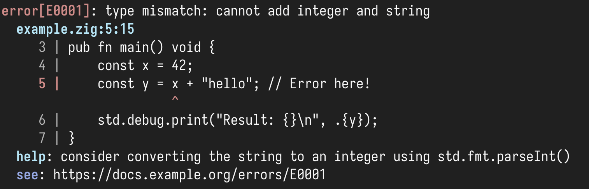

# fehler

A comprehensive error reporting system for Zig that provides rich, colorful diagnostic output similar to modern compilers like Rust's `rustc` and Zig's own compiler.


## Features

- 🎨 **Colorful Output**: ANSI color-coded diagnostics with severity-based coloring
- 📍 **Source Location**: Precise file, line, and column error reporting
- 📝 **Source Context**: Displays source code snippets with error highlighting
- 🔧 **Help Messages**: Optional help text for guiding users to solutions
- 🏗️ **Fluent Interface**: Builder pattern for easy diagnostic construction
- 🧠 **Memory Safe**: Proper memory management with allocator-based design

## Install

Run this command in the root of your Zig project:

```shell
zig fetch --save "git+https://github.com/ciathefed/fehler"
```

Add this snippet to your `build.zig`:

```zig
const fehler = b.dependency("fehler", .{
    .target = target,
    .optimize = optimize,
});
exe_mod.addImport("fehler", fehler.module("fehler"));
```

## Quick Start

```zig
const std = @import("std");
const ErrorReporter = @import("fehler").ErrorReporter;
const Diagnostic = @import("fehler").Diagnostic;
const Severity = @import("fehler").Severity;

pub fn main() !void {
    var gpa = std.heap.GeneralPurposeAllocator(.{}){};
    defer _ = gpa.deinit();
    const allocator = gpa.allocator();

    var reporter = ErrorReporter.init(allocator);
    defer reporter.deinit();

    // Add source code
    const source =
        \\const std = @import("std");
        \\
        \\pub fn main() void {
        \\    const x = 42;
        \\    const y = x + "hello"; // Error here!
        \\    std.debug.print("Result: {}\n", .{y});
        \\}
    ;

    try reporter.addSource("example.zig", source);

    // Create and report diagnostic
    const diagnostic = Diagnostic.init(.err, "type mismatch: cannot add integer and string")
        .withLocation(.{
            .file = "example.zig",
            .line = 5,
            .column = 15,
        })
        .withHelp("consider converting the string to an integer using std.fmt.parseInt()");

    reporter.report(diagnostic);
}
```

## Output Example

The above code produces output like this:



## API Reference

### Core Types

#### `Severity`
Represents the severity level of a diagnostic:
- `.err` - Error (red)
- `.warn` - Warning (yellow)
- `.note` - Note/info (blue)

```zig
const severity = Severity.err;
const color = severity.color();  // Returns ANSI color code
const label = severity.label();  // Returns "error", "warning", or "note"
```

#### `SourceLoc`
Represents a location in source code:

```zig
const location = SourceLoc{
    .file = "main.zig",
    .line = 42,
    .column = 10,
};
```

#### `Diagnostic`
The main diagnostic message structure:

```zig
// Basic diagnostic
const diag = Diagnostic.init(.err, "undefined variable 'foo'");

// With location
const diag_with_loc = Diagnostic.init(.err, "undefined variable 'foo'")
    .withLocation(SourceLoc{
        .file = "main.zig",
        .line = 10,
        .column = 5
    });

// With help text
const diag_with_help = Diagnostic.init(.warn, "unused variable 'bar'")
    .withHelp("prefix with '_' to silence this warning");

// Chained (fluent interface)
const full_diag = Diagnostic.init(.err, "parse error")
    .withLocation(location)
    .withHelp("expected ';' after expression");
```

#### `ErrorReporter`
The main error reporting system:

```zig
// Initialize
var reporter = ErrorReporter.init(allocator);
defer reporter.deinit();

// Add source files
try reporter.addSource("main.zig", source_content);

// Report single diagnostic
reporter.report(diagnostic);

// Report multiple diagnostics
const diagnostics = [_]Diagnostic{ diag1, diag2, diag3 };
reporter.reportMany(&diagnostics);
```

### Convenience Functions

#### `createDiagnostic`
Shorthand for creating diagnostics with location:

```zig
const diag = createDiagnostic(
    .err,
    "syntax error",
    "parser.zig",
    25,
    8
);
// Equivalent to:
// Diagnostic.init(.err, "syntax error")
//     .withLocation(SourceLoc{ .file = "parser.zig", .line = 25, .column = 8 })
```

## Contributing

Contributions are welcome. If you find a bug or want to add a feature, open an issue or pull request.

To contribute code:

1. Fork the repository
2. Create a new branch
3. Make your changes
4. Open a pull request with a clear description

Please follow the [Conventional Commits](https://www.conventionalcommits.org/) format for commit messages. Examples:

- `fix: handle empty source input in reporter`
- `feat: add support for multiple source files`
- `refactor: simplify diagnostic builder`

Keep changes focused and minimal. Include tests when appropriate.

## License

This project is licensed under the [MIT License](./LICENSE)
